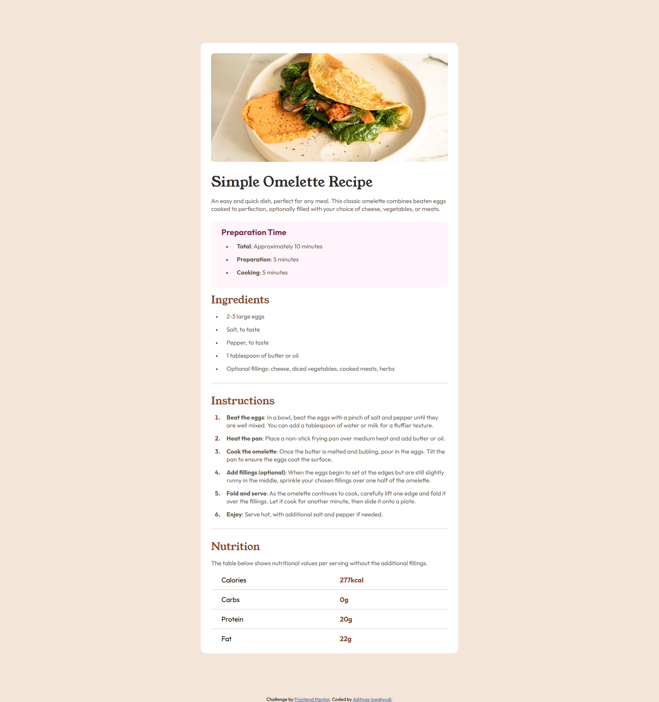

# Frontend Mentor - Recipe Page Solution

This is my solution to the Recipe Page challenge from Frontend Mentor. This project focuses on building a clean and structured layout for displaying recipe content, including ingredients, instructions, and preparation details.

---

## Table of contents

- [Overview](#overview)
  - [Screenshot](#screenshot)
  - [Links](#links)

- [My process](#my-process)
  - [Built with](#built-with)
  - [What I learned](#what-i-learned)
  - [Continued development](#continued-development)
  - [Useful resources](#useful-resources)
  - [AI Collaboration](#ai-collaboration)

- [Author](#author)

---

## Overview

### Screenshot

---

### Links

- Solution URL: https://www.frontendmentor.io/solutions/recipe-page-solution-FI66Jo5Ov8
- Live Site URL: https://aditiyas10.github.io/recipe-page/

---

## My process

### Built with

- Semantic HTML5
- CSS (Flexbox & basic layout)
- Mobile-first workflow

---

### What I learned

This project helped me improve how I structure content-heavy layouts using semantic HTML.

I also learned:

- How to organize long content into readable sections
- How to manage spacing between sections
- How to create a clean and readable layout
- How to apply consistent typography

---

### Continued development

Going forward, I want to:

- Improve typography and visual hierarchy
- Practice more responsive layouts
- Learn CSS Grid for more complex page structures
- Build more content-based UI designs

---

### Useful resources

- https://developer.mozilla.org/en-US/docs/Web/CSS
  Main reference for CSS properties

- https://css-tricks.com/snippets/css/a-guide-to-flexbox/
  Helped me better understand layout

---

### AI Collaboration

I used AI tools to:

- Understand layout structuring
- Debug spacing and alignment issues
- Get explanations for CSS behavior

---

## Author

- Name: Aditiyas
- Frontend Mentor: https://www.frontendmentor.io/profile/aditiyas10

---
